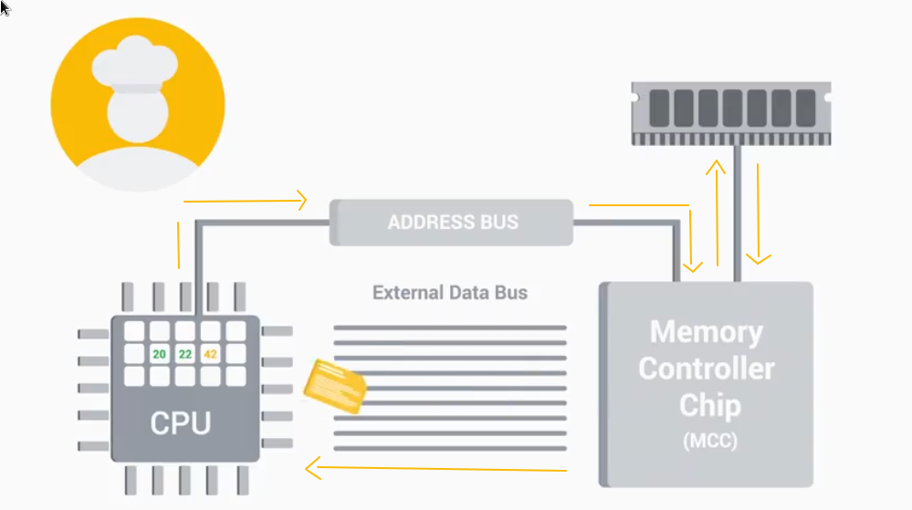

# [The modern Computer] - [2025-07-30]

🎯 In IT, **hardware** is an essential topic to understand.
The objective of this course is to describe all the physical parts of computer and how they work together.

---

### Introduction to Hardwares

Typical **desktop** setup:

- A monitor 🖥️
- A keyboard ⌨️
- A mouse 🖱️
- The desktop ⚙️

We also can include:

- Printer setup
- Speakers
- Webcam

🔌 At the back of the computer:

- Display port (HDMI,  )
- Audio port
- USB port
- Network connection port

⚙️ Components in the computer:

- CPU (Central Processing Unit)
- RAM (Random access memory)
- The Hard drive
- The Motherboard

---

### Programs, CPU and memory

A CPU constantly receives instruction and executes them.\
It calculates very fast *e.g. an Intel Core i7 can perform 177,730 **MIPS** (Millions of Instructions Per Second) at a **clock speed** of 3.33 **GHz**.* \
All the instructions are written in binary.

These information travel around the computer using **external data bus (EDB)**, divide by "on-off" state wires (or binary voltage).\
It comes in diff sizes (A bit, 16-bit, 32 even 64).

Inside the CPU they're components known as **registers**, they allow to store the data that our CPU works with.\
*e.g. To add two number a CPU need to store each number, the result and the operator in diff register*

Our programs are copied into RAM for the CPU to read, it represents a lot (some billion) of data  and CPU needs to read RAM data quickly as possible.\
Therefore, we use **the memory controller chip (MCC)** instead of **EDB**.\
Also, CPU and MCC using that called **address bus** that store the location of the data.

---

### 📚 Notions

**CPU (Central Processing Unit):** The brain of our computer, it does all the calculations and data processing.

**RAM (Random access memory):** Our computer's short-term memory

**Hard drive:** Holds all of our data, which includes all of our files, pictures, applications etc.

**Motherboard:** The body or circulatory system of the computer that connects all the pieces together

**Programs:** Instruction that tell the computer what to do

**External data bus (EDB):** A row of wires that interconnect the parts of our computer.

**memory controller chip (MCC)**: The bridge between CPU and RAM.

**Clock rate:** The frequency (hertz or Hz) at which a computer's CPU executes instructions.

