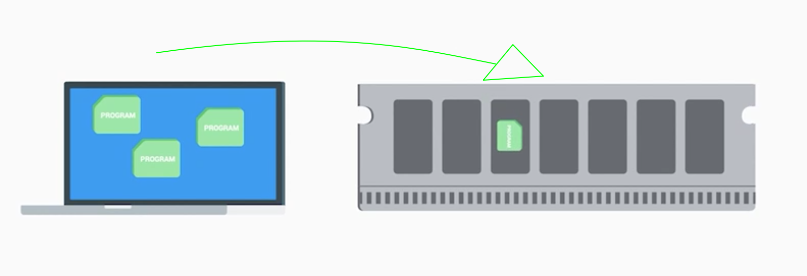

# Components [2025-08-04]

General IT support tasks for hardware:
- Replacing failed hard disks
- Upgrading RAM modules
- Installing video cards

### CPU

*The computer's brain.*

🧠 The CPU uses an **instruction set** to translate and perform functions on data (a list of instructions).
*e.g. Adding, subtracting, copying data, etc.*

⚠️ When you select your **CPU**, check its compatibility with your **motherboard**. Make sure both sockets match.

🛠️ CPUs have lots of **tiny pin sockets** (two main types):
- **Land Grid Array (LGA)**
- **Pin Grid Array (PGA)**

⚠️ Make sure to include an efficient **heat sink** to dissipate heat from the CPU and prevent overheating.

🔢 CPUs have a **bit architecture**, which represents the size of their **registers** (usually 16-bit, 32-bit, or 64-bit).
➡️ Some low-profile (less than 4GB RAM) or older computers (32-bit CPU) may need 32-bit applications to run better.

---

### RAM

*The computer's short-term memory.*

💾 Almost all RAM is volatile; its data is cleared when the computer is powered off.
To run a program, we need to make a copy of it in RAM so the CPU can process it.

💡 The amount of available RAM (e.g. 16GB) means you can run up to 16GB of programs at the same time.

# Notions

**LGA Socket (LGA):** An LGA socket has pins coming out of the motherboard.

**Pin Grid Array (PGA):** A PGA socket has pins coming out of the CPU itself.

**Bit architecture:** Specifies how much data a CPU can efficiently handle. It can be 8-bit (64KB), 32-bit (4GB), or 64-bit (256TB). This represents the maximum addressable memory of a computer.

**CPU register:** A small, fast storage location inside the CPU used to hold data temporarily.
